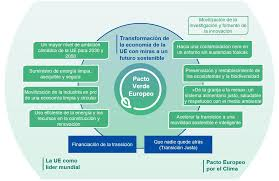

# 1.5. Marco normativo y regulador de la sostenibilidad en Europa

El propósito de un marco normativo y regulador, es ayudar a las empresas a cumplir las leyes, políticas y normativas. En el caso de la sostenibilidad es una herramienta que indica qué tipo de información no financiera se ha de publicar, qué estructura otorgarle al contenido y el orden de presentación de la información. Este marco normativo regula la fomentación del desarrollo sostenible y de una economía socioambiental más responsable. Su uso es obligatorio para toda empresa que le afecte la Ley de información no financiera y diversidad 11/2018.Antes de elegir qué tipo de marco normativo es el más adecuado para nuestra empresa, debemos estudiar las diferentes opciones, porque aunque todos persiguen los mismos objetivos, disponen de características diferentes. 

   
 
La CSRD, directiva de la Unión Europea vigente desde el 5 de enero de 2023, (predecida por la NFRD), con el objetivo de ampliar el alcance y mejorar la calidad de los informes sobre sostenibilidad, exige que las empresas revelen sus impactos ambientales y sociales, y cómo sus impactos ambientales, sociales y de gobernanza (ESG) afectan al planeta. Además les exigen el informe de las métricas (cuantitativas por toneladas y ambientales en términos de emisiones de gases de efecto invernadero GEI) de emisiones de CO2 que afectan al medio ambiente, los objetivos para reducir esas emisiones y el resultado financiero del logro de esos objetivos. El informe debe ser verificado por auditores externos, detallado, preciso, visible púbicamente y comparativo, señalando los riesgos y las oportunidades relacionados con la sostenibilidad que puedan afectar al negocio a corto, medio y largo plazo.

Resumiendo, la CSRD mejora la transparencia de la información relacionada con la sostenibilidad,impulsa la inversión sostenible, establece normas comunes, claras, verificables y responsables.

    
 
